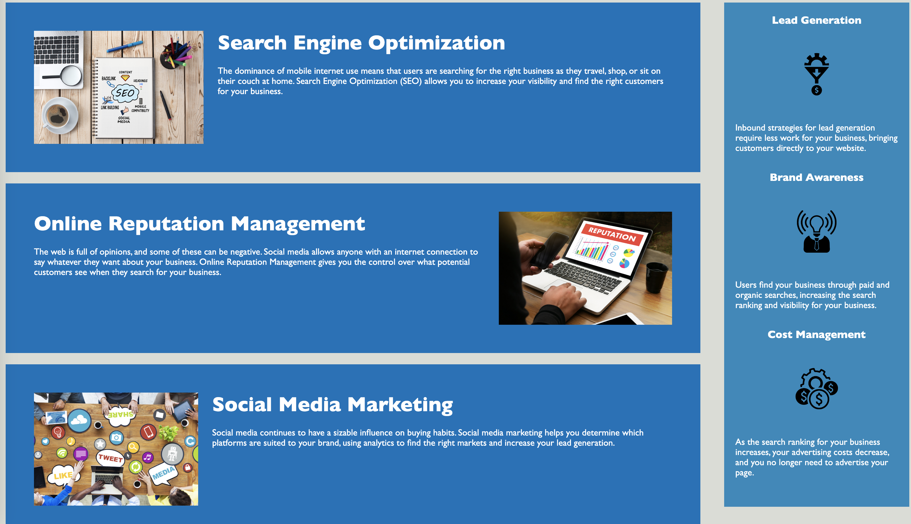

# horiseon-code-refactoring

## Description

My motivation for this assignment was to provide the most semantically appealing code so I could start to figure out my style. I built this project because I wanted to test how I could make code look cleaner while making it more accessible. The problem this project solved was providing more accessible code so that if someone else looked at it, the coder could pinpoint what was happening faster. Therefore, this project allows for a more accessible website. In addition, I learned the impact certain semantic tags have on the overall code.

## Installation

N/A

## Usage

This Horiseon website allows the user to easily navigate toward Search Engine Optimization, Online Reputation Management, and Social Media Marketing information through the navbar or by scrolling down. In addition, the user will also find Horiseon's information on Lead Generation, Brand Awareness, and Cost management on the right side of the page.

Here is a screenshot of the application:

Here is a screenshot of the application after pressing the buttons on the navbar:

You can access the application at [Deployed Application Link](https://etapm.github.io/horiseon-code-refactoring/)

## Credits

N/A

## License

The last section of a high-quality README file is the license. This lets other developers know what they can and cannot do with your project. If you need help choosing a license, refer to https://choosealicense.com/.

🏆 The previous sections are the bare minimum, and your project will ultimately determine the content of this document. You might also want to consider adding the following sections.

## Badges

N/A

## Features

N/A

## How to Contribute

N/A

## Tests

N/A
